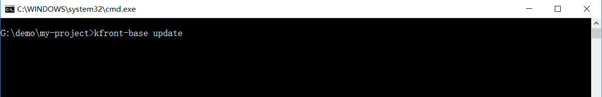
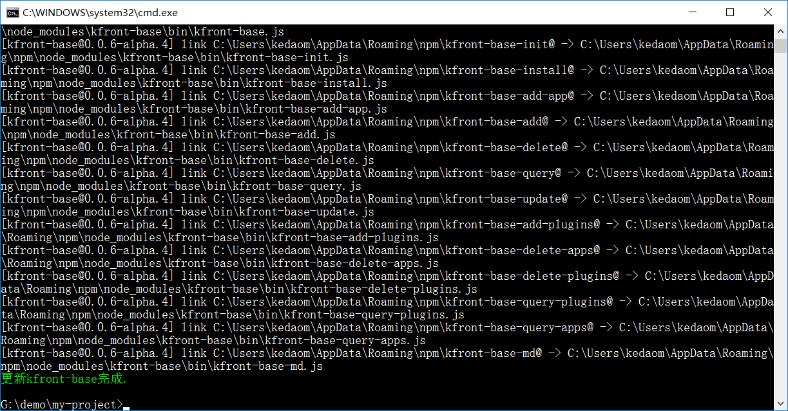

<style>
  .code-block {
    width:95%;
    background-color:#000000;
    color:green;
    vertical-align:middle
  }
</style>

# generator-kfront-base
generator-kfrontbase是一款前端工程自动化的脚手架工具，可以在命令行工具中通过执行命令完成相应的操作。

## 安装方法

###  Windows下全局安装

  ```
    $ npm install -g generator-kfrontbase
  ```

###  Linux下全局安装

  ```
    $ sudo npm install -g generator-kfrontbase
  ```

## 使用方法

####  查看kfront-base 的所有命令
  ```
    $ kfront-base
  ```

####  创建新工程
  ```
    $ kfront-base init-app
  ```

####  添加子工程
  ```
    $ cd <主工程名>
    $ kfront-base add-subapp
  ```

####  删除子工程
  ```
    $ cd <主工程名>
    $ kfront-base delete-subapp
  ```

####  添加单个或多个插件
  ```
    $ cd <主工程名>
    $ kfront-base add-plugin
  ```

####  删除单个或多个插件
  ```
    $ cd <主工程名>
    $ kfront-base delete-plugin
  ```

####  更新kfront-base
  ```
    $ cd <主工程名>
    $ kfront-base update
  ```

## 示例教程

  1.安装kfront-base依赖包

  全局安装kfront-base：

    Windos系统下运行命令：$ npm install -g generator-kfrontbase

    Linux系统下运行命令：$ npm install -g generator-kfrontbase


  

  2.创建工程

    运行命令：$ kfront-base init-app
    输入项目名称：my-app
    输入项目版本号：0.0.1
    选择技术栈：vue 【默认是vue,使用 arrow up/arrow down + 回车键 即可完成选中】
    选择安装组件库：kfront-base 【默认安装kfront-base,可根据项目需要自行选择，只需输入 y/n + 回车键 即可完成选择,等待几秒钟项目文件被创建成功】

  
  

  3.添加插件

    运行命令：$ kfront-base add-plugin
    输入插件名称：jstree,echarts 【添加多个插件时用逗号分隔】
    选择是给哪个子工程添加插件：输入 arrow up/ arrow down + 回车键 【等待依赖包安装完成】

  
  
  
  
  

  4.查看已有的插件

    运行命令：$ kfront-base query-plugin

  

  5.删除插件

    运行命令：$ kfront-base delete-plugin
    输入插件名称：jstree,echarts 【删除多个插件时用逗号分隔】
    确认要删除的插件：输入 y/n + 回车键 【删除多个插件时会提示某个子工程依赖某个要删除的插件，请仔细查看提示后再做删除】

  
  
  
  


  6.添加子工程

    运行命令：$ kfront-base add-subapp
    输入子工程名称：my-subapp

  
  
  

  7.查看已有的子工程

    运行命令：$ kfront-base query-subapp

  

  6.删除子工程

    运行命令：$ kfront-base delete-subapp
    请输入要删除的子工程名称【删除多个子工程以逗号分隔】:app01,app02
    确认删除的子工程: 输入 y/n + 回车键 【直接按下回车键并不会删除子工程】

  
  
  
  

  7.更新kfront-base

    运行命令：$ kfront-base update

  
  

## 注意事项

  1.项目目录结构创建成功后，项目根目录下回生成kfront-base的配置文件kfront-base.json，请不要删除该文件。

  2.除“kfront-base init-app”命令之外的所有命令必须在项目根目录下执行。

  3.如果您要启动项目服务，请使用新的命令行窗口运行：npm run dev。

  4.kfront-base命令使用的顺序告知：

    (1) kfront-base init-app

    (2) kfront-base install

    (3) kfront-base add-plugin 或者 kfront-base add-subapp

    (4) kfront-base query-plugin 或者 kfront-base query-subapp
    或者 kfront-base delete-plugin 或者 kfront-base delete-subapp

    (5) kfront-base update

## License
MIT
